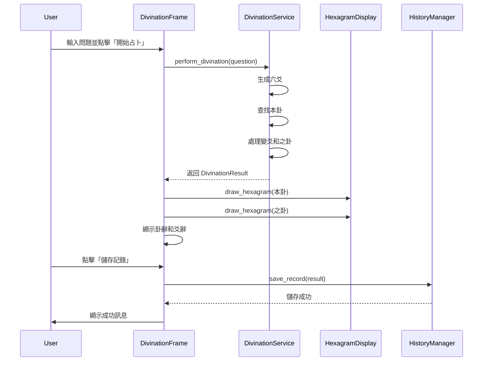
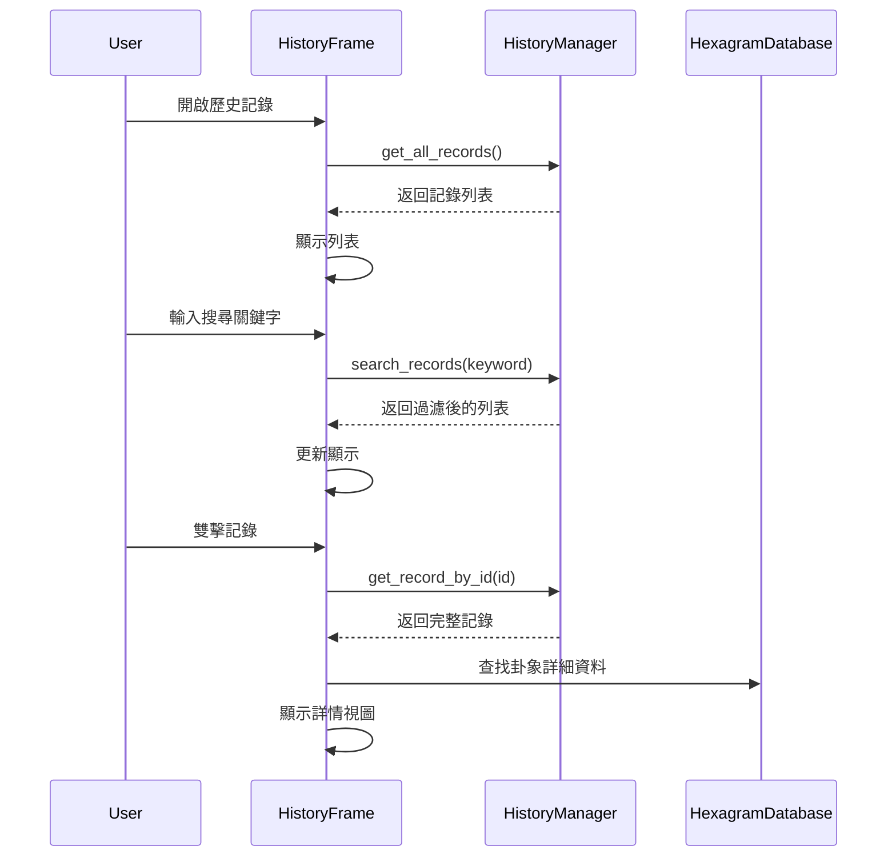

# GUI 介面設計文件

## 概述

本設計文件描述易經卜卦系統的圖形化使用者介面（GUI）實現方案。GUI 將使用 Python 的 tkinter 庫構建，重用現有的核心業務邏輯（DivinationService、HexagramDatabase、HistoryManager），僅添加視覺化展示層。

### 設計目標

- 提供直觀易用的圖形介面
- 保持與 CLI 版本相同的核心功能
- 實現美觀的卦象視覺化
- 確保跨平台相容性
- 最小化外部依賴（僅使用 tkinter）

## 架構

### 整體架構

```
┌─────────────────────────────────────────┐
│         GUI Layer (新增)                 │
│  ┌─────────────────────────────────┐   │
│  │   MainWindow (主視窗)            │   │
│  │   ├─ DivinationFrame (卜卦框架)  │   │
│  │   ├─ HistoryFrame (歷史框架)     │   │
│  │   └─ AboutFrame (關於框架)       │   │
│  └─────────────────────────────────┘   │
│  ┌─────────────────────────────────┐   │
│  │   HexagramDisplay (卦象顯示)     │   │
│  └─────────────────────────────────┘   │
└─────────────────────────────────────────┘
                  ↓
┌─────────────────────────────────────────┐
│      Business Logic Layer (重用)        │
│  ┌─────────────────────────────────┐   │
│  │   DivinationService              │   │
│  │   HexagramDatabase               │   │
│  │   HistoryManager                 │   │
│  └─────────────────────────────────┘   │
└─────────────────────────────────────────┘
```

### 模組結構

```
src/
├── gui/                    # 新增 GUI 模組
│   ├── __init__.py
│   ├── main_window.py      # 主視窗
│   ├── divination_frame.py # 卜卦介面
│   ├── history_frame.py    # 歷史記錄介面
│   ├── hexagram_display.py # 卦象顯示元件
│   ├── styles.py           # 樣式配置
│   └── utils.py            # GUI 工具函數
├── models/                 # 現有模組（重用）
├── services/               # 現有模組（重用）
├── data/                   # 現有模組（重用）
└── cli/                    # 現有模組（保留）

main_gui.py                 # GUI 程式入口
main.py                     # CLI 程式入口（保留）
```

## 元件設計

### 1. MainWindow (主視窗)

**職責：**
- 管理應用程式的主視窗
- 處理視窗切換和導航
- 初始化核心服務

**介面：**
```python
class MainWindow:
    def __init__(self, root: tk.Tk)
    def show_home(self) -> None
    def show_divination(self) -> None
    def show_history(self) -> None
    def show_about(self) -> None
```

**佈局設計：**
```
┌────────────────────────────────────────┐
│  易經卜卦系統                           │
│  ════════════════════════════════════  │
│                                        │
│         ☯ 易經卜卦系統 ☯                │
│                                        │
│      ┌──────────────────────┐         │
│      │    開始卜卦 🎲        │         │
│      └──────────────────────┘         │
│                                        │
│      ┌──────────────────────┐         │
│      │    查看歷史 📚        │         │
│      └──────────────────────┘         │
│                                        │
│      ┌──────────────────────┐         │
│      │    關於本程式 ℹ️       │         │
│      └──────────────────────┘         │
│                                        │
└────────────────────────────────────────┘
```

### 2. DivinationFrame (卜卦框架)

**職責：**
- 處理卜卦流程的 UI
- 收集使用者輸入（問題）
- 顯示卜卦過程和結果
- 提供儲存選項

**介面：**
```python
class DivinationFrame:
    def __init__(self, parent: tk.Frame, service: DivinationService)
    def perform_divination(self) -> None
    def display_result(self, result: DivinationResult) -> None
    def save_to_history(self) -> None
    def clear_and_return(self) -> None
```

**佈局設計：**

**步驟 1：輸入問題**
```
┌────────────────────────────────────────┐
│  ← 返回                                 │
│  ════════════════════════════════════  │
│                                        │
│  請輸入您的問題：                       │
│  ┌────────────────────────────────┐   │
│  │                                │   │
│  │                                │   │
│  └────────────────────────────────┘   │
│                                        │
│         ┌──────────────┐              │
│         │  開始占卜 🎲  │              │
│         └──────────────┘              │
│                                        │
└────────────────────────────────────────┘
```

**步驟 2：顯示結果**
```
┌────────────────────────────────────────┐
│  ← 返回                    儲存記錄 💾  │
│  ════════════════════════════════════  │
│                                        │
│  問題：今年事業運勢如何？               │
│                                        │
│  ┌──────────────┬──────────────┐      │
│  │   本卦       │   之卦       │      │
│  │  ━━━━━━ ⚡   │  ━━  ━━      │      │
│  │  ━━  ━━      │  ━━  ━━      │      │
│  │  ━━━━━━      │  ━━━━━━      │      │
│  │  ━━  ━━      │  ━━  ━━      │      │
│  │  ━━━━━━      │  ━━━━━━      │      │
│  │  ━━━━━━      │  ━━━━━━      │      │
│  │              │              │      │
│  │  乾為天      │  天風姤      │      │
│  │  第 1 卦     │  第 44 卦    │      │
│  └──────────────┴──────────────┘      │
│                                        │
│  卦辭：                                 │
│  ┌────────────────────────────────┐   │
│  │ 乾：元亨利貞。                  │   │
│  │                                │   │
│  │ 變爻：                          │   │
│  │ 上九：亢龍有悔。                │   │
│  │                                │   │
│  │ 之卦：                          │   │
│  │ 姤：女壯，勿用取女。            │   │
│  └────────────────────────────────┘   │
│                                        │
└────────────────────────────────────────┘
```

### 3. HexagramDisplay (卦象顯示元件)

**職責：**
- 繪製卦象的視覺化表示
- 標記變爻
- 顯示卦名和基本資訊

**介面：**
```python
class HexagramDisplay:
    def __init__(self, parent: tk.Frame)
    def draw_hexagram(self, hexagram: Hexagram, 
                     show_changing: bool = True) -> None
    def draw_yao(self, canvas: tk.Canvas, yao: Yao, 
                y_position: int) -> None
    def clear(self) -> None
```

**繪製規則：**
- 陽爻：實線 `━━━━━━` (寬度 100px，高度 10px)
- 陰爻：斷線 `━━  ━━` (兩段各 40px，間隔 20px)
- 變爻標記：在爻旁邊顯示 `⚡` 或使用不同顏色
- 爻的間距：15px
- 從下到上繪製（初爻在最下方）

**顏色方案：**
- 普通陽爻：深藍色 `#2C3E50`
- 普通陰爻：深藍色 `#2C3E50`
- 變爻（老陽/老陰）：金色 `#F39C12` 或紅色 `#E74C3C`
- 背景：淺灰色 `#ECF0F1` 或白色

### 4. HistoryFrame (歷史記錄框架)

**職責：**
- 顯示歷史記錄列表
- 提供搜尋功能
- 顯示記錄詳情

**介面：**
```python
class HistoryFrame:
    def __init__(self, parent: tk.Frame, 
                history_manager: HistoryManager,
                database: HexagramDatabase)
    def load_records(self) -> None
    def search_records(self, keyword: str) -> None
    def show_record_detail(self, record_id: str) -> None
    def refresh(self) -> None
```

**佈局設計：**

**列表視圖**
```
┌────────────────────────────────────────┐
│  ← 返回                                 │
│  ════════════════════════════════════  │
│                                        │
│  搜尋：┌──────────────────────┐ 🔍    │
│       │                      │        │
│       └──────────────────────┘        │
│                                        │
│  ┌────────────────────────────────┐   │
│  │ 📅 2025-10-07 14:30           │   │
│  │ 問題：今年事業運勢如何？       │   │
│  │ 本卦：乾為天 → 之卦：天風姤   │   │
│  ├────────────────────────────────┤   │
│  │ 📅 2025-10-06 09:15           │   │
│  │ 問題：是否適合投資？           │   │
│  │ 本卦：坤為地                   │   │
│  ├────────────────────────────────┤   │
│  │ ...                            │   │
│  └────────────────────────────────┘   │
│                                        │
│  雙擊記錄查看詳情                       │
│                                        │
└────────────────────────────────────────┘
```

**詳情視圖**
```
┌────────────────────────────────────────┐
│  ← 返回列表                             │
│  ════════════════════════════════════  │
│                                        │
│  時間：2025-10-07 14:30:25             │
│  問題：今年事業運勢如何？               │
│                                        │
│  [顯示完整卦象和解釋，與卜卦結果相同]   │
│                                        │
└────────────────────────────────────────┘
```

### 5. Styles (樣式配置)

**職責：**
- 集中管理 UI 樣式
- 提供一致的配色方案
- 定義字體和尺寸

**配置：**
```python
class Styles:
    # 顏色
    PRIMARY_COLOR = "#2C3E50"      # 深藍灰
    SECONDARY_COLOR = "#34495E"    # 中藍灰
    ACCENT_COLOR = "#F39C12"       # 金色
    BACKGROUND_COLOR = "#ECF0F1"   # 淺灰
    TEXT_COLOR = "#2C3E50"         # 深色文字
    LIGHT_TEXT = "#7F8C8D"         # 淺色文字
    
    # 變爻顏色
    CHANGING_YAO_COLOR = "#E74C3C" # 紅色
    
    # 字體
    TITLE_FONT = ("Microsoft YaHei UI", 20, "bold")
    HEADING_FONT = ("Microsoft YaHei UI", 14, "bold")
    BODY_FONT = ("Microsoft YaHei UI", 11)
    BUTTON_FONT = ("Microsoft YaHei UI", 12)
    
    # 尺寸
    WINDOW_WIDTH = 800
    WINDOW_HEIGHT = 600
    BUTTON_WIDTH = 20
    BUTTON_HEIGHT = 2
    PADDING = 10
```

## 資料流

### 卜卦流程



### 歷史記錄流程



## 錯誤處理

### 錯誤類型和處理策略

1. **資料載入錯誤**
   - 場景：hexagrams.json 無法載入
   - 處理：顯示錯誤對話框，提示使用者檢查檔案，然後退出程式

2. **歷史記錄錯誤**
   - 場景：history.json 讀寫失敗
   - 處理：顯示警告訊息，但允許繼續使用卜卦功能

3. **輸入驗證錯誤**
   - 場景：使用者未輸入問題
   - 處理：顯示提示訊息，要求輸入問題

4. **未預期錯誤**
   - 場景：程式執行時發生異常
   - 處理：顯示友善的錯誤對話框，記錄錯誤日誌

### 錯誤對話框設計

```python
def show_error(title: str, message: str) -> None:
    messagebox.showerror(title, message)

def show_warning(title: str, message: str) -> None:
    messagebox.showwarning(title, message)

def show_info(title: str, message: str) -> None:
    messagebox.showinfo(title, message)
```

## 測試策略

### 單元測試

- 測試 HexagramDisplay 的繪製邏輯
- 測試樣式配置的正確性
- 測試 GUI 工具函數

### 整合測試

- 測試 DivinationFrame 與 DivinationService 的整合
- 測試 HistoryFrame 與 HistoryManager 的整合
- 測試視窗切換和導航

### 手動測試

- 在 Windows、macOS、Linux 上測試 UI 顯示
- 測試中文字元顯示
- 測試視窗縮放和響應式佈局
- 測試使用者互動流程

## 效能考量

### 優化策略

1. **延遲載入**
   - 只在需要時載入歷史記錄
   - 使用虛擬滾動處理大量歷史記錄

2. **快取**
   - 快取已繪製的卦象圖形
   - 快取查詢結果

3. **非同步操作**
   - 使用 threading 處理耗時操作（如果需要）
   - 避免阻塞 UI 主執行緒

4. **記憶體管理**
   - 及時清理不再使用的 Canvas 物件
   - 限制歷史記錄的顯示數量

## 跨平台相容性

### 平台特定處理

1. **字體選擇**
   ```python
   def get_default_font():
       if sys.platform == 'win32':
           return "Microsoft YaHei UI"
       elif sys.platform == 'darwin':
           return "PingFang TC"
       else:
           return "Noto Sans CJK TC"
   ```

2. **視窗樣式**
   - Windows：使用預設主題
   - macOS：使用 aqua 主題
   - Linux：使用 clam 或 alt 主題

3. **檔案路徑**
   - 使用 `os.path.join()` 處理路徑
   - 確保跨平台路徑相容性

## 未來擴展

### 可能的增強功能

1. **動畫效果**
   - 卜卦過程的動畫（銅錢翻轉）
   - 爻的生成動畫
   - 視窗切換動畫

2. **自訂主題**
   - 允許使用者選擇配色方案
   - 明亮/暗黑模式切換

3. **匯出功能**
   - 匯出卜卦結果為圖片
   - 匯出歷史記錄為 PDF

4. **進階功能**
   - 卦象比較功能
   - 統計分析（最常出現的卦象）
   - 筆記功能（為記錄添加註解）

5. **多語言支援**
   - 簡體中文
   - 英文
   - 其他語言

## 總結

本設計提供了一個完整的 GUI 實現方案，重用現有的核心業務邏輯，僅添加視覺化展示層。使用 tkinter 確保了跨平台相容性和零外部依賴。設計注重使用者體驗，提供直觀的操作流程和美觀的視覺呈現。
